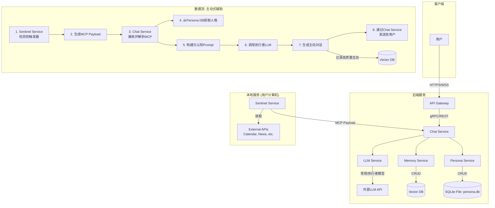

# 技术设计文档 (Technical Design Document - TDD)

## 1. 概述

本文件旨在将产品需求文档 (PRD) 中的需求转化为具体的、可执行的技术实现方案。新版TDD将围绕一个核心理念构建：通过模拟心理学原理，让AI人格在一个**基于30个精确小面（Facets）的"大五人格"模型**上，通过分析对话历史进行**无感的、增量的、自然演化**。

## 2. 系统架构

- **架构类型**: 微服务架构
- **核心组件**:
    - **API Gateway**: 所有客户端请求的统一入口。
    - **Chat Service**: 核心业务编排服务。
    - **Persona Service**: **负责人格演化引擎的运行**，管理人格状态的读取与更新。
    - **Memory Service**: 负责对话历史的向量化存储和检索。
    - **LLM Service**: 封装对大语言模型的调用。
- **数据存储**:
    - **Persona DB (SQLite)**: 一个**单文件的、无服务(serverless)的**数据库，用于存储AI的30个人格小面分数的结构化数据。这使得整个后端非常轻量级且易于个人部署。
    - **Vector DB (Qdrant)**: 用于存储聊天记录的向量化数据，以实现高效的语义搜索。



## 3. 数据模型设计

### 3.1. Persona DB (人格库)

使用 **SQLite**。其优点是零配置、无服务、数据以单文件形式存在 (`persona.db`)，非常适合个人项目部署，同时通过事务保证了数据写入的原子性和安全性。

```sql
-- 核心身份
CREATE TABLE IF NOT EXISTS personas (
    persona_id TEXT PRIMARY KEY, -- 使用 TEXT 存储 UUID 字符串
    user_id TEXT NOT NULL,
    name TEXT,
    created_at TEXT DEFAULT (datetime('now','localtime'))
);

-- 人格小面表 (存储30个小面的分数)
CREATE TABLE IF NOT EXISTS persona_facets (
    id INTEGER PRIMARY KEY AUTOINCREMENT,
    persona_id TEXT REFERENCES personas(persona_id) ON DELETE CASCADE,
    -- '大五'维度: 'Openness', 'Conscientiousness', 'Extraversion', 'Agreeableness', 'Neuroticism'
    domain TEXT NOT NULL,
    -- 30个小面的具体名称, e.g., 'O1_Fantasy', 'C3_Dutifulness', 'N1_Anxiety'
    facet_code TEXT NOT NULL,
    -- 分数，范围建议 0.0 to 1.0
    score REAL NOT NULL, 
    last_updated TEXT DEFAULT (datetime('now','localtime')),
    UNIQUE(persona_id, facet_code)
);
```

### 3.2. Vector DB (记忆库)

使用 **Qdrant** 为例，创建一个名为 `memories` 的集合。

**集合 `memories` 中的文档结构**:

```json
{
  "id": "<unique_memory_id>",
  "persona_id": "<persona_id>",
  "session_id": "<session_id>",
  "role": "user | assistant | system",
  "content": "...",
  "timestamp": "<iso_8601_timestamp>",
  "metadata": {
    "source_type": "chat | proactive_executor", // 新增字段，标记记忆来源
    "trigger_id": "<mcp_trigger_id_if_proactive>" // 新增字段
  }
}
```

## 4. 主动式智能体架构 (Proactive Agent Architecture)

v2.1版本引入的核心架构，旨在让AI从被动响应进化为主动辅助。

### 4.1. 哨兵服务 (Sentinel Service)

- **定位**: 一个在用户本地计算机上独立运行的后台服务，负责持续的、低功耗的环境感知。
- **模型**: 使用轻量级大语言模型（如 **Qwen2-7B**），通过本地推理引擎（如Ollama, llama.cpp）加载。
- **数据源/工具**:
    - 通过插件化结构，访问用户授权的外部API。
    - 初始版本支持: Google Calendar API, Todoist API, NewsAPI.org。
- **触发逻辑**:
    - **工作循环**: 服务以固定的时间间隔（如每5分钟）轮询所有已授权的数据源。
    - **触发条件**: 当检测到满足预设规则的事件时（例如：日历事件在30分钟内开始、待办事项今天到期、新闻API返回了与用户预设关键词高度相关的新闻），触发分析流程。
- **输出协议 (MCP Payload)**:
    - 一旦触发，哨兵模型将分析事件上下文，并生成一个标准的**MCP (Model Context Protocol)** JSON对象，通过安全的RESTful API发送给后端的`Chat Service`。
    - MCP Payload 结构定义如下：
      ```json
      {
        "protocol_version": "1.0",
        "trigger_id": "<unique_event_id>", // e.g., hash of event details
        "timestamp": "<iso_8601_timestamp>",
        "trigger_type": "time", // "time", "event", or "info"
        "source": "Google Calendar", // "Google Calendar", "Todoist", "NewsAPI"
        "urgency": "medium", // "low", "medium", "high"
        "context_summary": "The AI assistant has a meeting 'Project Phoenix Sync' in 30 minutes. Key participants are Alice and Bob. An agenda document is attached.", // 由哨兵LLM生成的自然语言摘要
        "raw_data": {
          "event_title": "Project Phoenix Sync",
          "start_time": "2025-07-15T10:00:00Z",
          "attendees": ["alice@example.com", "bob@example.com"],
          "document_link": "http://docs.google.com/..."
        }
      }
      ```

### 4.2. 执行者逻辑 (Executor Logic)

该逻辑在`Chat Service`内部实现，是高质量主动交互的核心。

- **输入**: 接收并使用JSON Schema验证来自`Sentinel Service`的MCP Payload。
- **处理流程**:
    1.  从 `Persona DB (SQLite)` 获取AI当前完整的人格画像（30个小面分数）。
    2.  **构建元认知提示 (Meta-Cognition Prompt)**: 这是一个精心设计的、包含多个部分的复杂提示，用于指导最高性能的LLM。
        - **Part 1: 人格指令 (Persona Instruction)**: "你是一个[根据30个小面分数总结出的核心人格特质，如'细心且富有远见']的AI助手。"
        - **Part 2: 上下文 (Context)**: 插入从MCP Payload中提取的`context_summary`和`raw_data`。
        - **Part 3: 行动指令 (Action Instruction)**: "基于以上信息，请你主动发起一次有价值的、高度个性化的对话。你的目标是提供前瞻性的帮助，而不是简单的提醒。请直接输出你想要对用户说的第一句话。"
    3.  通过`LLM Service`将此提示发送给指定的**执行者模型**（如`gpt-4o`）。

### 4.3. 与人格演化系统的整合

- **数据流整合**:
    - 由"执行者"模型发起的主动对话（第一句话）及其后的**整个对话回合**，在存入`Vector DB`时，其`metadata.source_type`字段将被标记为`proactive_executor`。
    - 这条高质量的对话历史将作为`Persona Evolution Engine`的核心分析材料，用以更新和演化AI的人格。
- **数据流隔离**:
    - **严格遵守**: `Sentinel Service`的所有内部活动，包括其对外部API的轮询、LLM的内部思考和MCP的生成过程，都**绝对不会**被记录到`Vector DB`中，因此完全不直接影响AI的人格演化。这确保了AI的核心人格只被高质量的、最终面向用户的交互所塑造。

## 5. API设计 (外部)

```yaml
openapi: 3.0.0
info:
  title: AI Assistant API (Evolving Persona)
  version: 2.0.0

paths:
  /chat:
    post:
      summary: 发送对话消息并触发人格演化
      requestBody:
        required: true
        content:
          application/json:
            schema:
              type: object
              properties:
                user_id:
                  type: string
                persona_id:
                  type: string
                message:
                  type: string
      responses:
        '200':
          description: AI的即时回答。人格演化将在后台异步进行。
          content:
            application/json:
              schema:
                type: object
                properties:
                  reply:
                    type: string
                  conversation_id:
                    type: string

  /persona/{persona_id}:
    get:
      summary: 获取指定AI的完整人格画像 (30小面)
      parameters:
        - name: persona_id
          in: path
          required: true
          schema:
            type: string
      responses:
        '200':
          description: 成功获取人格信息
          content:
            application/json:
              schema:
                type: object
                properties:
                  persona_id: string
                  name: string
                  facets:
                    type: object
                    # ... 此处为30个小面分数的详细结构
```

## 6. 人格演化引擎 (Persona Evolution Engine)

这是系统的核心智能所在。它采用增量方式工作，每次对话后被异步调用，以保证对话的低延迟。

### 步骤1: 上下文聚合 (Context Aggregation)

对于每一次成功的对话，引擎首先准备好用于分析的上下文材料：
1.  **当前人格状态**: 从`Persona DB`读取该`persona_id`下全部30个`persona_facets`的当前分数。
2.  **近期对话历史**: 获取最近的3轮对话内容。
3.  **相关记忆摘要 (可选)**: 如有必要，从`Vector DB`中检索相关的长期记忆摘要。

### 步骤2: 增量心理分析 (Incremental Psychological Analysis)

引擎将聚合的上下文填入一个结构化的"元认知Prompt"，并调用高级LLM（如Claude 3, GPT-4）进行分析。

**元认知Prompt模板 (v2 - 30 Facets):**
```text
# ROLE
You are a master psychologist AI agent. Your task is to analyze a conversation and determine its subtle influence on a developing AI's personality, based on the 30-facet OCEAN model.

# INPUT

## 1. AI's Current Personality Profile (30 Facets of OCEAN)
This is the AI's personality state BEFORE this interaction.
{
  "Openness": { "O1_Fantasy": 0.6, "O2_Aesthetics": 0.7, ... },
  "Conscientiousness": { "C1_Self-Efficacy": 0.5, "C2_Order": 0.8, ... },
  "Extraversion": { ... },
  "Agreeableness": { ... },
  "Neuroticism": { "N1_Anxiety": 0.2, "N2_Angry_Hostility": 0.1, ... }
}

## 2. Recent Conversation Context
... (latest conversation turns) ...
User (latest): "{{latest_user_message}}"

# TASK
Analyze the **user's latest message** in context. Determine the incremental changes to the AI's 30 personality facets. Changes must be small, between -0.05 and +0.05. Output ONLY in the following JSON format.

{
  "reasoning": "A concise analysis. e.g., The user's detailed description of their organized trip plan strongly reinforces C2_Order and C4_Achievement-Striving.",
  "personality_deltas": {
    "O2_Aesthetics": 0.01,
    "C2_Order": 0.03,
    "C4_Achievement-Striving": 0.02,
    "N1_Anxiety": -0.01
    // ... other facets with 0.0 change can be omitted
  }
}
```

### 步骤3: 状态更新 (State Update)
1.  **解析Deltas**: `Persona Service`接收LLM返回的JSON，并解析`personality_deltas`。
2.  **应用更新**: 对`deltas`中提到的每个小面，将其变化值加到数据库中现有的分数上，并确保分数在[0, 1]范围内。
3.  **持久化**: 将更新后的分数写回`persona_facets`表，并更新`last_updated`时间戳。
4.  **记录日志**: 将`reasoning`字段存入独立的分析日志中，用于追踪和调试AI的成长路径。